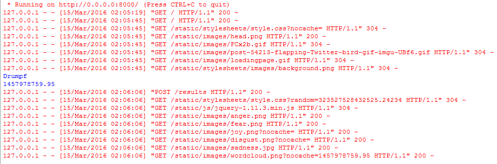
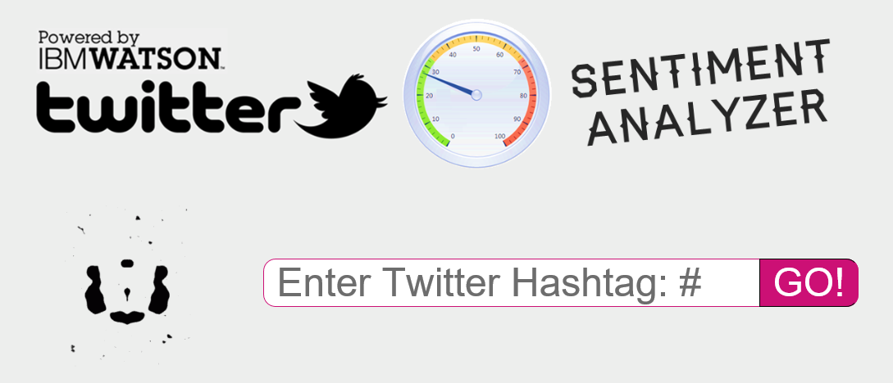
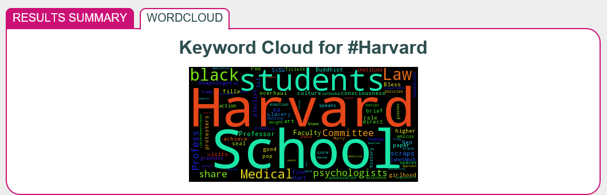

<h1> Twitter Sentiment Analysis on Alchemy API </h1>

Use Alchemy API to obtain a real-time sentiment pulse for a Twitter Hashtag; also use wordcloud to visualize the key topics of discussion

Demo: http://twitter-sentiment-analyser.mybluemix.net/

<h1> Key Components </h1>

1. Alchemy Emotional Analysis API
2. Alchemy Keyword/Term Extraction API
3. WordCloud Python Library
4. Python Flask Framework
5. HTML/CSS/JS
6. BlueMix Hosting Configurations

   

   

   

   
